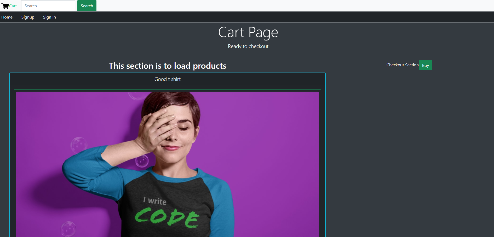

# ibrahimstore-Ecommerce

This project is build using MERN Stack (MongoDB,Express,React,Nodejs)

This project has :
1. User
2. Admin 

Each of them have different roles to play 
1. User: 
This is the person who will have access to the website from the frontend and will have all the functionalities like : 
a) Creating a user account by logging in  
b) Can view products which are listed onto the website (without login) 
c) Place an order for a particular product 
d) Track the order which was placed  

2. Admin 
He has the leading role here, a person who owns this e-commerce business. The functionalities which he can perform are: 
a) Creating products which he wants to list onto the website 
b) Managing products: delete, edit etc.. 
c) Creating categories for his products 
d) Managing categories  
e) Managing orders placed by his customers: updating the order status, clearing up placed orders etc.. 

This projects was build for businesses which require a quick solution for moving their venture online and also for people who need such open soure projects  

### App Home page where products are listed

### Signup page for the user to create an account

### Cart page where user can view items which were added to cart
User can remove items from cart if needed

### Mobile responsive

